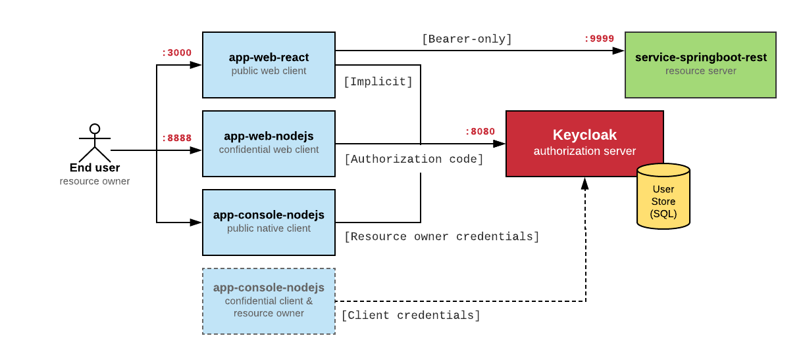

# Keycloak examples

This repository consists of sample apps showcasing identity and access management features of [Keycloak](http://www.keycloak.org/). 

Before you start please make sure you have decent understanding of what [OAuth2.0](https://oauth.net/2/) and [OpenID Connect](http://openid.net/connect/) protocols fundamentally are.
Here is a good point to start: [What the Heck is OAuth?](https://developer.okta.com/blog/2017/06/21/what-the-heck-is-oauth)

## Overview

This repository recreates all authorization scenarios mentioned
in the OAuth2.0 spec to highlight differences in obtaining access tokens
for different application types.

Collectively, sample apps create the following architecture:



- **keycloak** - The resource server issuing access tokens to the client after successfully authenticating the resource owner and obtaining authorization.
- [app-web-nodejs](./app-web-nodejs) - A client showing how to obtain grants from Keycloak in a classic, server-based web application written in HapiJS using OAuth's Authorization Code Grant.
- [app-web-react](./app-web-react) - A client showing how to obtain grants from Keycloak in a modern web application (SPA) written in React using OAuth's Implicit Grant.
- [app-console-nodejs](./app-console-nodejs) - A client showing how to obtain grants for both users and the application itself in a console app (native app) using OAuth's Resource Owner Password Credentials and Client Credentials Grants.
- [service-springboot-rest](./service-springboot-rest) - A resource server
showing how to validate access tokens issued by Keycloak and passed
by the clients in a REST service (Spring Boot-based REST API).

Before you start with any of the apps, you'll need to set up
the authorization server first.

## Setting up Keycloak

1. You'll need a local running instance of Keycloak (the authorization server). There are 2 ways you can set this up:

    - **run it from a Docker image**

        *Prerequsite*: [Docker CE](https://docs.docker.com/install/) and [docker-compose](https://docs.docker.com/compose/install/)

        Run it using the following command:

        ```bash
        $ docker-compose up -d
        ```

    - **run it from a distro**

        *Prerequsite*: [JDK 8](http://www.oracle.com/technetwork/java/javase/downloads/jdk8-downloads-2133151.html)

        1. Download [Keycloak 3.4.3.Final](https://www.keycloak.org/archive/downloads-3.4.3.html) archive
        2. Unpack it and run it using the following command:
        
        ```bash
        $ $KEYCLOAK_HOME/bin/standalone.sh
        ```

        3. Open `http://localhost:8080` in your browser and set up admin credentials (for example `admin:admin`)

2. Verify that Keycloak is up and running by accessing `http://localhost:8080` in your browser and logging in with admin credentials.
3. For running the examples, Keycloak needs to be configured with sample users, groups and clients.
   If you run Keycloak from a docker-compose, it's already been taken care of.
   However, when you run it from a distro, you should configure it manually.
   Luckilly, required configuration can be found in a single `examples-realm.json` file.
   
   * Login to Keycloak Admin Console
   * Hover on the master realm and click **Add realm**.
   * Select the ``examples-realm.json`` file and click **Create**.

Now you're all set up to run the examples.


